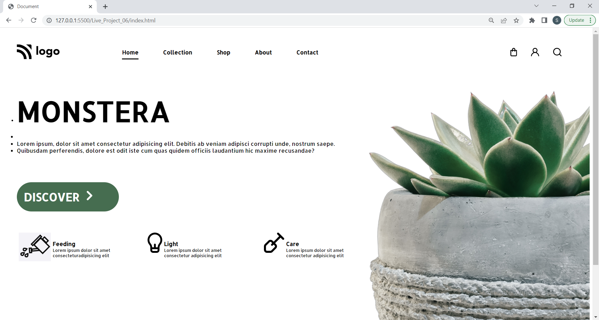

# Plant-Nursery-Website []

This is basically a one pager Template project made in HTML/CSS for an imaginary plant nursery on the internet.
Hope you like my project !! it works good in laptop screen if you are using desktop please zoom in or out that might work .

## Technologies Used
  - HTML
  - CSS

## Demo


Clone the project

```bash
  git clone https://github.com/suhas-sm/Plant-Nursery-Website.git
```

Go to the project directory

```bash
  cd Plant-Nursery-Website
```
## Features

- Good Background Image
- Beautifull UI/UX Design
- One Pager Website
- Image Position and alignment

## What i have learnt By working on this project
1. I have improved my self in positioning of images in a spesific position
2. Improved in designing the project

## Honest Time to finish the project

I had took about 40 min. This project made me understand how to make an image as a background

## Feedback

If you have any feedback, please reach out to us at melmurissm11@gmail.com
